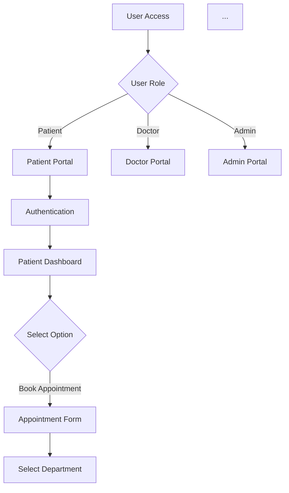

# Medi-Queue System Flowchart - Generation Prompt

## Overview
This document provides a detailed prompt used to generate the comprehensive flowchart for the Medi-Queue medical appointment queue management system.

---

## Detailed Generation Prompt

### Project Context
Create a comprehensive flowchart for **Medi-Queue**, a medical appointment and queue management system with three user roles: Patients, Doctors, and Administrators. The system manages patient appointments, real-time queue tracking, medical reports, and prescriptions.

### System Architecture Components

#### 1. Frontend (React.js with Vite)
- **Patient Portal**: Dashboard, Appointments, Prescriptions, Reports, Queue Status, History
- **Doctor Portal**: Dashboard, Queue Management, Patient Consultations
- **Admin Portal**: Dashboard, Patient/Doctor Management, Statistics

#### 2. Backend (Express.js with Node.js)
- **Routes**: 
  - Authentication (Register, Login, JWT tokens)
  - Appointments (Book, View, Cancel, Reschedule)
  - Queue Management (Live queue, Position tracking, Next patient)
  - Reports (Upload, Rename, Delete)
  - Prescriptions (Create, View)
  - Admin Functions (User management, Statistics)
  
- **Database**: MongoDB with Mongoose
  - Users (Patient, Doctor, Admin)
  - Appointments
  - Reports
  - Prescriptions
  - Queue records

#### 3. External Services
- **ImageKit**: Cloud file storage for medical reports (with fallback to local storage)
- **Socket.io**: Real-time queue updates and notifications

---

## Flowchart Structure

### Sections to Include

#### A. Entry Point & Authentication
- User arrives at system
- Role selection (Patient/Doctor/Admin)
- Login/Registration flow
- Authentication check with JWT tokens

#### B. Patient Flow
1. **Dashboard View**
   - Health summary
   - Appointment count
   - Queue status
   - Available reports

2. **Book Appointment**
   - Select department/specialty
   - Choose doctor
   - Pick date and time slot
   - Verify availability
   - Enter consultation reason
   - Assign unique queue token
   - Show confirmation

3. **View Appointments**
   - List all appointments (active, pending, completed, cancelled)
   - Filter options
   - Cancel/reschedule options

4. **Queue Status (Live Queue Tracker)**
   - Display patient's queue number
   - Show patients ahead
   - Calculate estimated wait time
   - Real-time updates via Socket.io
   - Doctor availability status

5. **Medical Reports**
   - File upload interface
   - Check ImageKit availability
   - Upload to cloud OR save locally (fallback)
   - Rename report
   - Delete report
   - Share with doctor

6. **View Prescriptions**
   - List from active doctors
   - Download/print options

7. **History**
   - Past consultations
   - Treatment records

#### C. Doctor Flow
1. **Authentication & Dashboard**
   - Doctor login
   - View queue statistics (current patient, next patient, waiting count)
   - View completed/cancelled counts for the day

2. **Queue Management**
   - View patient queue (sorted by queue number)
   - Call next patient (auto-increment queue)
   - Mark patient as in-consultation
   - View patient details (medical history, reports)
   - Write prescription
   - Mark consultation as completed

3. **Live Queue View**
   - Real-time patient list
   - Queue position updates
   - Patient status indicators

4. **History**
   - View past consultations
   - Patient records

#### D. Admin Flow
1. **Dashboard**
   - System statistics (total patients, doctors, appointments)
   - Activity metrics

2. **Patient Management**
   - Create new patient
   - View all patients
   - Edit patient information
   - Search/filter patients

3. **Doctor Management**
   - Create new doctor account
   - View all doctors
   - Assign departments/specializations
   - Edit doctor information

4. **Appointment Management**
   - View all appointments across system
   - Walk-in patient registration
   - Manual queue management
   - Appointment statistics

#### E. Backend System Architecture
1. **Express.js Server**
   - Handles all API routes
   - Middleware (authentication, role-based access control)

2. **API Routes**
   - Authentication: Register, Login, Token verification
   - Appointments: CRUD operations, cancellations
   - Queue: Live queue, position calculation, next patient
   - Reports: Upload, rename, delete
   - Prescriptions: Create, view
   - Admin: User and appointment management

3. **MongoDB Database**
   - Users collection (with role field)
   - Appointments collection (with queue number, status, timestamps)
   - Reports collection (with storage metadata for ImageKit/local)
   - Prescriptions collection

#### F. External Services & Storage
1. **ImageKit API**
   - Cloud file storage for reports
   - Fallback: Local filesystem storage (`/Backend/uploads/reports/`)
   - File operations: Upload, Rename, Delete

2. **Socket.io**
   - Real-time queue updates
   - Doctor notifications
   - Patient position updates
   - Live doctor availability status

3. **Storage Strategy**
   - Try ImageKit first (cloud)
   - Fallback to local disk if ImageKit fails
   - Track storage type in MongoDB for file operations

---

## Key Business Logic Flows

### Queue Token Assignment
- When patient books appointment:
  1. Check for duplicate bookings
  2. Count existing appointments for doctor+date
  3. Assign unique queue number (atomic operation)
  4. Return queue token to patient

### Real-time Queue Updates
- When doctor calls next patient:
  1. Doctor clicks "Call Next" button
  2. Backend marks previous as "completed"
  3. Finds next pending appointment (sorted by queue number)
  4. Marks as "approved" (in-consultation)
  5. Socket.io emits `queueUpdated` event to all connected patients
  6. Patients' dashboards refresh in real-time

### Report Upload with Fallback
- When patient uploads report:
  1. Try upload to ImageKit cloud
  2. If ImageKit returns 500 error:
     - Save to local disk (`/uploads/reports/`)
     - Record storage type as "local" in MongoDB
  3. Generate accessible URL
  4. Store metadata (fileName, fileUrl, filePath, storageType)

---

## Visual Style & Color Coding

- **User Entry & Portals** (Light Blue): Entry points and main portal sections
- **Patient Portal** (Light Green): Patient-specific features and flows
- **Doctor Portal** (Light Yellow): Doctor-specific workflows
- **Admin Portal** (Light Orange): Admin functions and controls
- **Backend System** (Light Green/Yellow): Server and API routes
- **External Services** (Light Purple): Third-party integrations
- **Storage** (Light Orange): File storage options

---

## Mermaid Diagram Syntax

Use Mermaid's graph TD (top-down) notation to create the flowchart:
- **Nodes**: Rounded for decisions ({}), rectangles for actions ([])
- **Connections**: Arrows with labels for different paths
- **Decision Points**: Diamond shapes for role/status checks
- **Styling**: Color fill for different sections of the system

---

## Additional Features to Consider

- **Real-time Notifications**: Patient alerts when it's their turn
- **SMS/Email Alerts**: Queue position notifications
- **Doctor Availability**: Status indicators (Available, On-Break, Offline)
- **Performance Metrics**: Dashboard statistics and analytics
- **Error Handling**: Fallback mechanisms (ImageKit failure, network issues)
- **Security**: JWT authentication, role-based access control, password encryption

---

## Deployment Considerations

- **Frontend**: Deployed on Vercel/Netlify (Vite build)
- **Backend**: Deployed on Heroku/AWS/DigitalOcean (Node.js server)
- **Database**: MongoDB Atlas (cloud)
- **File Storage**: ImageKit with local fallback
- **Real-time**: Socket.io with stable WebSocket connection

---

## How to Use This Prompt

1. **For AI/LLM Systems**: Use this entire prompt to generate flowcharts programmatically
2. **For Diagram Tools**: Reference the sections to manually create diagrams in Lucidchart, Draw.io, etc.
3. **For Documentation**: Share with stakeholders to explain system architecture
4. **For Development**: Guide developers through the system flows
5. **For Testing**: Use as checklist for all user workflows and edge cases

---

## Example Mermaid Generation

The flowchart is generated using Mermaid's graph syntax:

This creates a hierarchical visualization of all user flows, backend processes, and system interactions.

---

## Maintenance & Updates

When the system changes:
- Add new routes/endpoints to Backend System section
- Update user flows if new features are added
- Refresh external service integrations
- Update authentication/authorization flows
- Document new database collections or schemas

---

**Last Updated**: May 12, 2026  
**Version**: 1.0  
**Project**: Medi-Queue Medical Appointment System
